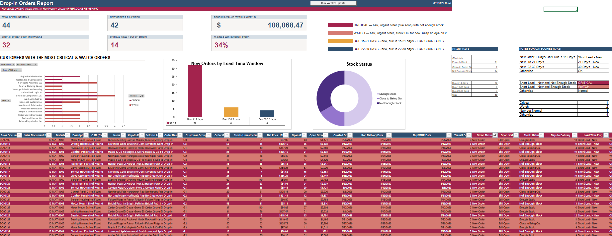

# 📦 Drop-In Order Risk Report

<p align="left">
  
  
  
  
  
</p>

🚨 Automatically flags new customer orders that land inside a firm production window without enough stock to cover them — turning a manual, easy-to-miss SAP review into a repeatable weekly report with clear priority, dollar exposure, and customer visibility.

---

> ℹ️ **Important — Confidentiality Notice**
>
> All datasets, screenshots, material numbers, customer names, dollar figures, and business records shown in this repository have been **anonymized, modified, or synthetically generated** for demonstration purposes. No confidential or proprietary company information is included. Where a specific number or metric would normally be shown, this README uses **approximate, illustrative values only**.

---

## 📖 Overview

This project is an **Excel + VBA automation tool** built to solve a recurring supply-chain visibility gap: new customer orders get entered into SAP continuously, and some of them land inside the near-term production window that's already firm — planned, staffed, and committed. When that happens without enough stock on hand, it can mean material shortages, expedited purchasing, overtime, premium freight, or missed customer delivery dates, often without anyone noticing until it's already a problem.

The tool pulls a weekly SAP export (`ZSDR0800`), compares it against the prior week's snapshot to identify what's actually new, evaluates each new order's stock position, and assigns a clear risk level — so purchasing, planning, and customer service can see the same prioritized list instead of everyone independently digging through raw SAP data.

## 🎯 Business Case

**Situation.** Customer orders are continuously entered into SAP, including ones with delivery dates inside the firm production window (the first ~14 days, where materials, labor, and capacity are already committed). These "drop-in" orders can create demand that wasn't accounted for when the schedule was built — but there was no standardized way to see how many came in each week or how urgent they were.

**Background.** Without a consolidated report, identifying these orders meant manually cross-referencing order-entry dates, delivery dates, and inventory across SAP screens — time-consuming, and inconsistent from person to person.

**Assessment.** A standardized weekly report separates genuinely urgent, understocked orders from orders that are merely new — so the team stops treating every near-term order as equally critical, and can prioritize the ones that actually need intervention.

**Recommendation.** A repeatable weekly report, refreshed from a single SAP export, with automated risk categorization and clear dollar/customer visibility.

**Estimated impact:** approximately **$75K–$150K annually**, from fewer expedited shipments, less overtime, fewer missed delivery dates, and reduced manual review time — figure is illustrative, based on internal estimation methodology.

## 🖥️ Dashboard Preview



*(See [Screenshot Guide](#-screenshot-guide) below for what each image shows.)*

## ⚙️ How It Works

1. Weekly `ZSDR0800` export (delivery dates ~3 months out) is pasted into a raw import tab.
2. Every line is automatically flagged: **New vs Existing** (compared against last week's saved snapshot), **Stock Status** (enough / close to being out / not enough), and a **Lead-Time Window** (due ≤14 days, 15–21 days, or 22–30 days).
3. Only new orders due within 14 days can become **Critical** (not enough stock) or **Watch** (stock currently OK) — everything else stays informational, keeping the signal from getting buried in noise.
4. A one-click macro logs the week's summary and rolls this week's data forward as next week's comparison baseline.
5. A PivotTable/PivotChart highlights which customers are generating the most Critical/Watch volume — useful for a direct conversation with sales or account management about lead-time expectations.

Full click-by-click instructions are in [`Setup_Instructions.md`](Setup_Instructions.md).

## 📊 Key Metrics & Features

- Total open order line items, and how many are brand new this week
- Dollar value of orders that are both urgent *and* short on stock
- % of urgent orders currently covered by available stock
- Customers generating the most Critical/Watch volume (PivotTable + chart)
- Distribution of new orders across 14 / 15–21 / 22–30 day windows
- Color-coded priority sorting (Critical → Watch → new-but-normal → everything else)
- One-click weekly rollover — no manual archiving or re-keying

## 🧰 Tech Stack

- **Excel formulas** — all flagging/risk logic is live, recalculating instantly as new data is pasted in (no macro needed for this part)
- **VBA macro** — handles the one weekly "close out this week, set up next week" step
- **PivotTable / PivotChart** — customer-level risk ranking, refreshed on demand

## 📁 Repo Contents

```
├── README.md
├── Setup_Instructions.md          # full click-by-click usage guide
├── Module1.bas                    # VBA macro source
├── Drop_In_Order_Risk_Report_DEMO.xlsm   # sample workbook, fake data pre-loaded
├── sample-data/
│   ├── ZSDR0800_Sample_Week1_LastWeek.xlsx
│   └── ZSDR0800_Sample_Week2_NewWeek.xlsx
└── screenshots/
```

## 🎓 Skills Demonstrated

- SAP data extraction and transformation for reporting purposes
- Excel/VBA tool design: live formula logic combined with a minimal, well-scoped macro
- Risk categorization and business-rule design (translating an operational problem into clear, defensible logic)
- Dashboard and data-visualization design, including PivotTable-based analysis
- Cross-functional problem framing (purchasing, planning, production, customer service)
- Technical documentation written for non-technical end users

## 📸 Screenshot Guide

- **`dashboard-overview.png`** — full Dashboard: KPI cards, both charts, color key. The single best "what does this do" image.
- **`customer-risk-chart.png`** — close-up of the Critical/Watch-by-customer chart, showing the analytical/PivotTable piece.
- **`lead-time-and-stock.png`** — the 14/21/30-day distribution chart alongside the stock-status breakdown.

---

*Built as a self-directed process-improvement project. Sample data in this repository is entirely synthetic.*
